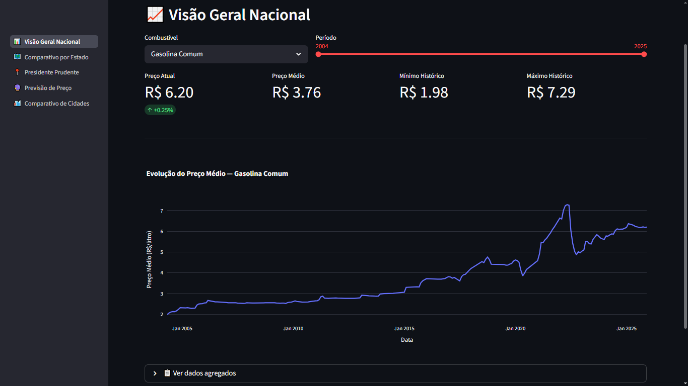
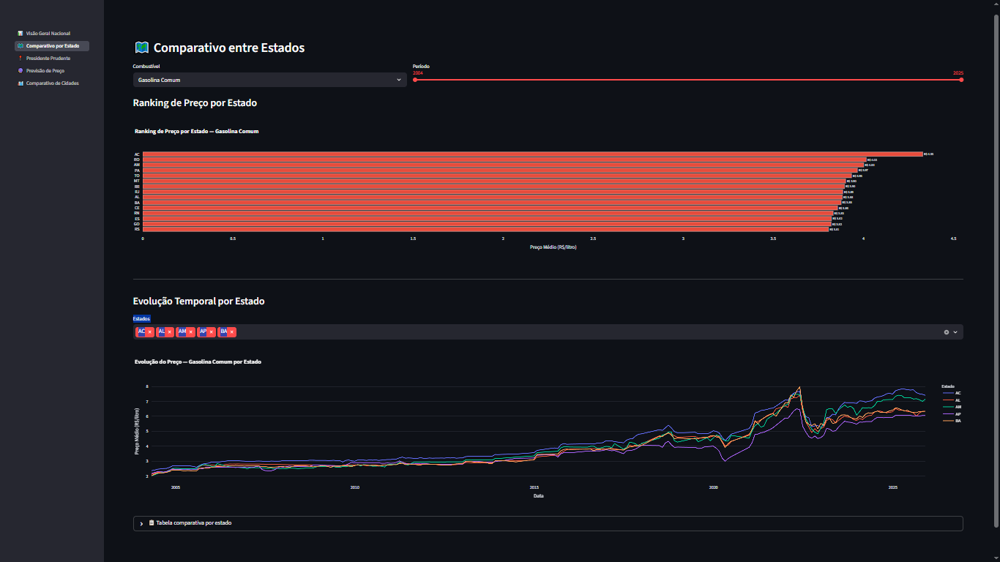
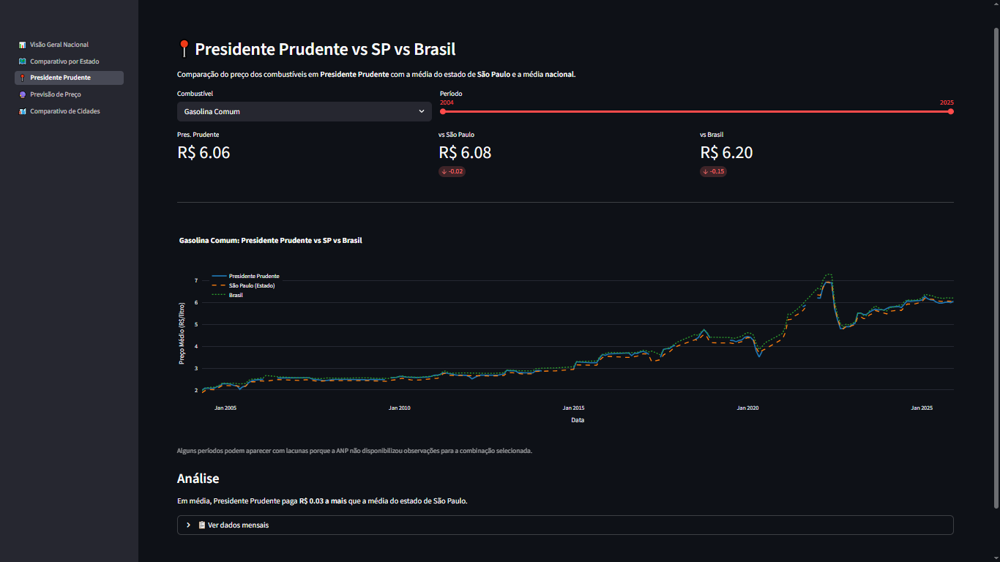
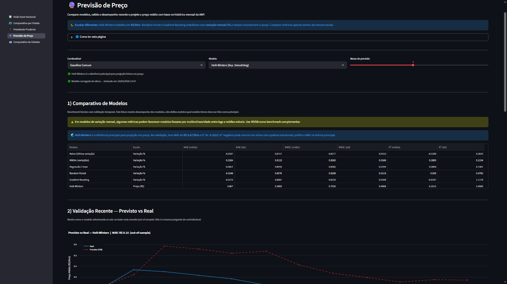
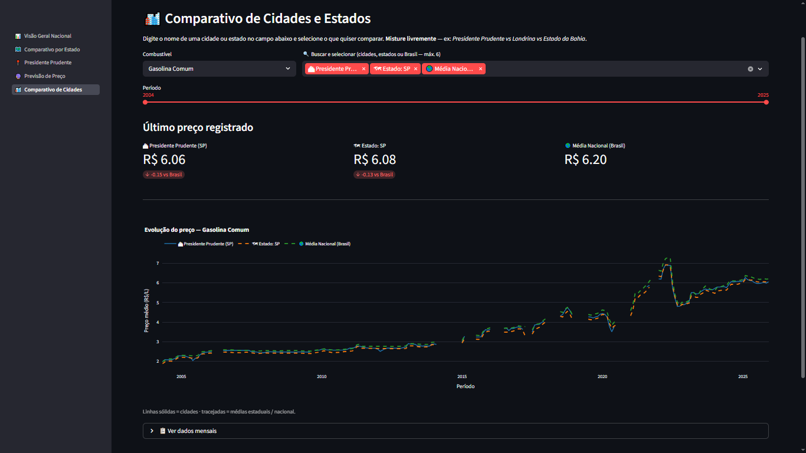

# ⛽ Combustível Brasil Analytics

Projeto de dados end-to-end com dados reais da ANP, cobrindo ingestão, ETL, análise exploratória, modelagem de Machine Learning e dashboard interativo.
O artefato processado atual consolida **20.484.968 registros** (2004–2025), e o `data/raw` atual contém **44 CSVs semestrais** (2004–2025).

> Projeto de portfólio desenvolvido por **Leonardo H. R. Ferreira**

---

## Funcionalidades

| Módulo | O que faz |
|--------|-----------|
| **Ingestão** | Scraping automático dos CSVs da ANP + cotação USD/BRL (BCB) + preço do Brent (EIA) |
| **ETL** | Limpeza e enriquecimento de ~20,5M registros (artefato processado atual) com batch processing + DuckDB para evitar OOM |
| **EDA** | Evolução histórica, sazonalidade, impacto de COVID / Guerra Ucrânia / política Petrobras |
| **ML** | Previsão de preços (Holt-Winters + Random Forest + Gradient Boosting + baselines) + clustering de municípios por KMeans + análise contrafactual de impacto de choques externos |
| **Correlação** | Correlação com lag entre preço do combustível, câmbio USD/BRL e Brent |
| **Dashboard** | App Streamlit com 5 páginas, filtros dinâmicos e gráficos Plotly interativos |

---

## Tecnologias

- **Python 3.13** · pandas · DuckDB · PyArrow
- **Machine Learning:** scikit-learn (Random Forest, Gradient Boosting, KMeans) · statsmodels>=0.14.0 (Holt-Winters)
- **Dashboard:** Streamlit · Plotly
- **Testes:** pytest — 55 testes automatizados
- **Dados:** ANP · Banco Central do Brasil · EIA (U.S. Energy Information Administration)

---

## Estrutura do Projeto

```
Combustivel Brasil Analytics/
├── data/
│   ├── raw/              # CSVs originais da ANP (44 arquivos semestrais, 2004–2025)
│   ├── processed/        # Parquet limpo (~20,5M registros no artefato atual) + agregações
│   │   └── models/       # Modelos ML treinados (.joblib)
│   └── external/         # Cotação dólar + preço Brent
├── src/
│   ├── etl.py            # Pipeline ETL com batch processing
│   ├── ml.py             # Modelos de previsão e clustering
│   ├── eda.py            # Funções de visualização
│   ├── scraping.py       # Coleta de dados externos
│   ├── ingestao.py       # Download dos CSVs da ANP
│   └── utils.py          # Configurações e utilitários
├── dashboard/
│   ├── app.py            # Entrada do Streamlit (st.navigation)
│   ├── pages/            # 5 páginas do dashboard
│   └── components/       # Gráficos e filtros reutilizáveis
├── notebooks/
│   ├── 01_ingestao.ipynb
│   ├── 02_etl_limpeza.ipynb
│   ├── 03_eda.ipynb
│   ├── 04_modelagem_ml.ipynb
│   └── 05_correlacao.ipynb
├── tests/                # 55 testes automatizados (ETL, ML, Scraping)
└── requirements.txt      # Dependências com versões fixas
```

---

## Como Rodar

### 1. Clonar e instalar

```bash
git clone https://github.com/leoh-coder/combustivel-brasil-analytics-review.git
cd combustivel-brasil-analytics-review
python -m venv .venv
source .venv/bin/activate  # Linux/Mac
# ou: .venv\Scripts\activate  (Windows)
pip install -r requirements.txt
```

### 2. Variáveis de ambiente (opcional — só para upload S3)

```bash
cp .env.example .env
# Preencher: AWS_ACCESS_KEY_ID, AWS_SECRET_ACCESS_KEY, S3_BUCKET_NAME
```

### 3. Baixar os dados da ANP

```bash
jupyter notebook notebooks/01_ingestao.ipynb
```

### 4. Executar o ETL

> ⚠️ O ETL completo leva ~15-30 minutos e processa ~20,5 milhões de registros no artefato atual.

```bash
python -c "
from src.etl import executar_pipeline_etl
executar_pipeline_etl(salvar_parquet=True, tamanho_lote=10)
"
```

### 5. Rodar o dashboard

```bash
python -m streamlit run dashboard/app.py
```

Acesse: **http://localhost:8501**

### 6. Rodar os notebooks (opcional)

```bash
jupyter notebook
# Execute na ordem: 01 → 02 → 03 → 04 → 05
# Se o ETL já rodou, pode começar direto do 03
```

### 7. Rodar os testes

```bash
pytest tests/ -v
```

---

## Sobre os Dados

| Periodo | Situacao |
|---------|----------|
| 2004-2025 | Em `data/raw`, ha 44 CSVs semestrais da ANP |
| 2004-2025 | Parquet principal (`data/processed/combustiveis_brasil.parquet`) com 20.484.968 registros |
| 2004-2026* | Em `data/external`, dolar e Brent podem avancar alem de 2025 conforme disponibilidade das fontes |

**Fonte:** [ANP - Agencia Nacional do Petroleo](https://www.gov.br/anp/pt-br/centrais-de-conteudo/dados-abertos/serie-historica-de-precos-de-combustiveis)

\* Esse periodo estendido se aplica apenas aos dados externos, nao aos CSVs da ANP nem ao parquet principal.

---

## Resultados do ML

| Modelo | Escala | MAE | R² |
|--------|--------|-----|----|
| Holt-Winters | Preço (R$/litro) | ~R$ 0,667/L | variável* |
| Random Forest | Variação % mensal | ~0,0146 | ~0,30–0,50 |
| Gradient Boosting | Variação % mensal | ~0,0140 | ~0,30–0,50 |

*R² do HW pode ser negativo em séries com quebras estruturais (COVID-19, guerra Ucrânia) — use o MAE como métrica principal.

Validação com **TimeSeriesSplit** (5 janelas temporais) — sem vazamento de dados futuros.

---

## Screenshots do Dashboard

As capturas abaixo mostram as principais páginas do dashboard Streamlit.

### Visão Geral Nacional



### Comparativo por Estado



### Presidente Prudente



### Previsão de Preço



### Comparativo de Cidades


---

## Autor

**Leonardo H. R. Ferreira**
[GitHub](https://github.com/leoh-coder) · [LinkedIn](https://linkedin.com/in/leonardo-henrique-ramos-ferreira-43aa632ba)
